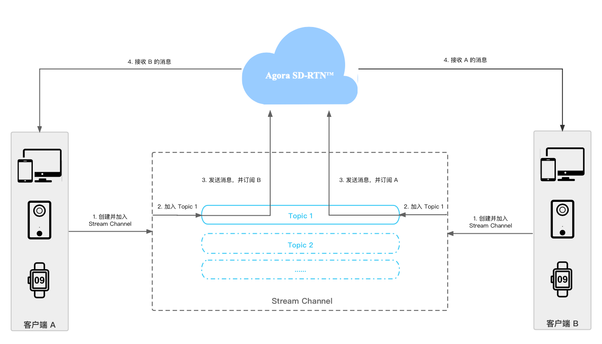

# RTM技术原理

本节展示 app 中实现发送和接收的基本工作流程：



1. 创建并加入 Stream Channel：调用 StreamChannel() 创建一个 StreamChannel 类型实例，再调用 Join 加入频道。
2. 加入 Topic：调用 JoinTopic 加入任意一个 Topic。
3. 在 Topic 中发送和订阅消息：调用 PublishTopic 发布消息，调用 SubscribeTopic 订阅远端用户的消息。
4. 接收远端用户的消息：通过 Subscribe Topic 返回的 `golang chan` 接收远端用户的消息。

# 前提条件

目前Agora RTM2 Golang SDK目前需要在特定的运行环境中执行，具体的`Dockerfile`在image/目录下

可以自行根据需求修改Dockerfile，目前仅列举依赖的最小集

# 运行原理

当前Golang SDK使用纯go实现，会在Login过程启动一个Sidecar来辅助实现RTM相关能力

对应Sidecar使用C++开发，二进制文件存放在image/rtm2-wrapper.exe

其依赖的动态库均存放在image/rtm2-so目录下

# 基本流程

## 1. 导入模块

```go
import "github.com/tomasliu-agora/rtm2"
```

## 2. 初始化 RTM Client，并登录

```go
config := rtm2.RTMConfig{Appid: "<APP_ID>", UserId: "<RTM_USER_ID>", Logger: lg}
ctx := context.Background()
errChan := make(chan error, 1) // 接收错误消息，重建rtm2 client, 详情见此文档“异常场景处理”部分
client := CreateRTM2Client(ctx, config, errChan)
// 使用 <RTM_TOKEN> token 登录RTM
// eventChan : 连接事件, 详情见此文档“异常场景处理”部分
// tokenChan : token will expire事件，详情见此文档“异常场景处理”部分
// messageChan: 点对点消息，详情见文档“点对点消息”部分
eventChan, tokenChan, messageChan, err := client.Login("<RTM_TOKEN>")
```

## 3. 创建 Stream Channel 并加入频道

在使用 StreamChannel 类中的任何 API 之前，你需要先调用 StreamChannel() 创建 Stream Channel。

```go
// 创建一个频道名为 MyChannel 的 Stream Channel
channel := client.StreamChannel("MyChannel")
// 加入频道
// snapshot : 当前频道快照，表示当前每个topic中有哪些用户
// topicEventChan : topic事件
// tokenChan : channel token will expire事件通知，和login时类似
snapshot, topicEventChan, tokenChan, err := channel.Join()
```

## 4. 加入频道中的 Topic 并发布消息

成功加入 Topic 后，SDK 会自动将你注册为该 Topic 的消息发布者，你可以在该 Topic 中发送消息。成功发送后，SDK 会把该消息分发给该 Topic 的所有订阅者。

```go
// 加入名为 MyTopic 的 Topic
err := channel.JoinTopic("MyTopic")
// 在 MyTopic 中发布内容为 data 的消息
err1 := channel.PublishTopic("MyTopic", []byte{"Hello world!\0"})
```

## 5. 订阅用户，获取已订阅用户列表，获取消息，取消订阅用户

调用 subscribeTopic 订阅一个 Topic 中的一位或多位消息发布者，在一个 Topic 中最多只能订阅 64 位消息发布者。你也可以通过 GetSubscribedUsers 查询当前已订阅的消息发布者列表。

```go
// 订阅 MyTopic 中 User ID 为 <OTHER_USER> 的用户
messageChan, err := channel.SubscribeTopic("MyTopic", []string{"<OTHER_USER>"})
// 启动 goroutine 拉取消息
go func() {
    for {
        select {
        case msg := <- messageChan:
            lg.Info("recv", zap.String("msg", string(msg)))
        case <- ctx.Done():
            return
        }
    }
}
// 获取 MyTopic 中你已经订阅的用户列表
users, err1 := channel.GetSubscribedUsers("MyTopic")
// 取消订阅 My Topic 中 User ID 为 <OTHER_USER> 的用户
err2 := channel.UnsubscribeTopic("MyTopic", []string{"<OTHER_USER>"})
```

## 6. 离开 Topic，离开频道，并登出

如果你不需要在该 Topic 中发送消息，调用 LeaveTopic 离开该 Topic。离开某个 Topic 不会影响你订阅其他 Topic 中的消息。如果你不再需要发送或接收该频道中的消息，调用 Leave 离开该频道。如果你不再需要使用 RTM 客户端，调用Logout 退出登录。

```go
// 离开 MyTopic
err := channel.LeaveTopic("MyTopic")
// 退出频道
err1 := channel.Leave()
channel = nil
// 登出
client.Logout()
```
# 点对点消息

```go
config := rtm2.RTMConfig{Appid: "<APP_ID>", UserId: "<RTM_USER_ID>", Logger: lg}
ctx := context.Background()
errChan := make(chan error, 1)
client := CreateRTM2Client(ctx, config, errChan)

_, _, messageChan, err := client.Login("<RTM_TOKEN>")
// 订阅点对点消息
go func() {
    for {
        select {
            case err := <-err:
            lg.Fatal("receive error from error channel", zap.Error(err))
            case msg := <-mc:  // 获取点对点消息
            lg.Info("get p2p message", zap.Any("detail", msg))
        }
    }
}()
// 发送点对点消息
// rtm2.WithMessageChannelType设置为rtm2.ChannelTypeUser表示发送点对点消息
// Publish的channel字段填写对端uid
go func() {
        remoteUid := "remote"
		ticker := time.NewTicker(time.Second)
		cnt := 0
		for {
			select {
			case <-ticker.C:
				message := "message-p2p-message-" + strconv.FormatInt(int64(cnt), 10)
				lg.Info("publish p2p message", zap.String("message", message))
				if err := client.Publish(remoteUid, []byte(message), 		   	           		rtm2.WithMessageType(rtm2.MessageTypeString), rtm2.WithMessageChannelType(rtm2.ChannelTypeUser)); err != nil {
					lg.Error("fail to publish p2p message", zap.Error(err))
				}
				cnt++
			}
		}
}()
```
# 异常场景处理
```go
	var client rtm2.RTMClient
	var rtmLoginToken string
	lcfg := zap.NewDevelopmentConfig()
	lcfg.Level.SetLevel(zapcore.InfoLevel)
	lg, _ := lcfg.Build()
	config := rtm2.RTMConfig{
		Appid:          testDynamicAppId,
		UserId:         *uid,
		Logger:         lg,
		FilePath:       *logPath,
		// RequestTimeout: 15 * 1000,  // 设置请求超时时间（默认10s)
	}
	for {
		ctx, cancel := context.WithCancel(context.Background())
		errChan := make(chan error, 10)
		client = CreateRTM2Client(ctx, config, errChan)
		// 生成login token
		rtmLoginToken = GenToken(testDynamicAppId, testDynamicCert, *uid, GenRandomStr(10), "60")

		if *useSidecar {
			client.SetParameters(map[string]interface{}{kParamSidecarPort: int32(*sidecarPort)})
			client.SetParameters(map[string]interface{}{kParamSidecarPath: *sidecarPath})
		} else {
			client.SetParameters(map[string]interface{}{kParamSidecarEndpoint: *edp})
		}
		connectionStateChannel, tc, err := client.Login(rtmLoginToken)
		if err != nil {
			lg.Error("fail to login", zap.Error(err))
			continue
		}
		// 监听error channel 事件
		// 监听connection state change事件
		// 监听login token过期事件
		go func() {
			for {
				select {
				case eve := <-connectionStateChannel:
					lg.Info("on connection state change", zap.Any("state", eve))
					switch eve.State {
					case rtm2.ConnectionStateFAILED:
						// 需要logout后重新创建rtm client
						_ = client.Logout()
						cancel()
						return
					default:
						// 不做处理
					}
				case err := <-errChan:
					// 收到err channel的error,说明可能存在rtm2-wrapper崩溃的情况，不能恢复，需要重建
					lg.Error("recv error from error channel, recreate rtm client", zap.Error(err))
					_ = client.Logout()
					cancel()
					return
				case channel := <-tc:
					// 收到token will expire事件时需要及时renew token
					// 当channel为空时，表示是login token过期，若不为空表示的是stream channel token过期
					// 此示例演示renew login token
					lg.Info("token will expire! try renew token", zap.String("channel", channel))
					rtmLoginToken = GenToken(testDynamicAppId, testDynamicCert, *uid, GenRandomStr(10), "60")
					err := client.RenewToken(rtmLoginToken)
					if err != nil {
						lg.Error("fail to renew token", zap.Error(err))
					} else {
						lg.Info("renew token success")
					}
				}
			}

		}()
		// 处理业务逻辑....
		_, c, err := client.Storage().SubscribeUserMetadata(*uid)
		if err != nil {
			lg.Fatal("fail to subscribe user metadata")
		}
		setTimer := time.NewTimer(time.Second)
		cnt := 0
		quit := false
		for !quit {
			select {
			case <-ctx.Done():
				// logout后所有channel都不可用，需要重新订阅
				lg.Info("context done")
				quit = true
				break
			case eve := <-c:
				lg.Info("on user metadata event", zap.Any("event", eve))
			case <-setTimer.C:
				data := map[string]*rtm2.MetadataItem{
					"name": {
						Key:      "name",
						Value:    *uid + strconv.FormatInt(int64(cnt), 10),
						Revision: -1,
					},
				}
				if err := client.Storage().SetUserMetadata(*uid, data, rtm2.WithStorageMajorRev(-1), rtm2.WithStorageRecordAuthor(true), rtm2.WithStorageRecordTs(true)); err != nil {
					lg.Error("fail to set user meta data", zap.Error(err))
				} else {
					lg.Info("set user meta data success")
				}
				cnt++
				setTimer.Reset(time.Second)
			}
		}
	}

```
# 开发注意事项

- 一条 RTM 消息可以是字符串或者二进制数据，你需要在业务层自行区分消息负载格式。为更灵活地实现你的业务，你也可以使用 JSON 等其他方式来构建你的负载格式，此时，你需要确保转交给 RTM 的消息负载已字符串序列化。
- userId 为不超过 64 位的任意字符串序列，且具有唯一性。不同用户、同一用户的不同终端设备需要通过不同的 userId 进行区分，所以你需要处理终端用户和 userId 的映射关系，确保终端用户的 userId 唯一且可以被复用。此外，项目中的 userId 数量还会影响最大连接数（PCU）的计量，从而影响计费。
- 成功离开频道后，你在该频道中注册的所有 Topic 发布者的角色以及你在所有 Topic 中的订阅关系都将自动解除。如需恢复之前注册的发布者角色和消息的订阅关系，声网推荐你在调用 leave 之前自行记录相关信息，以便后续重新调用 join、joinTopic 和 subscribeTopic 进行相关设置。